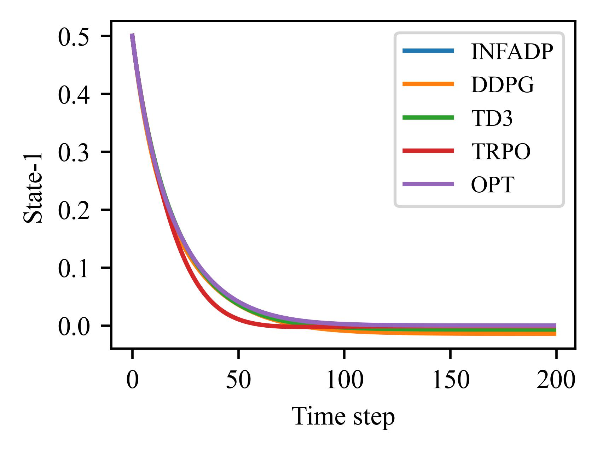
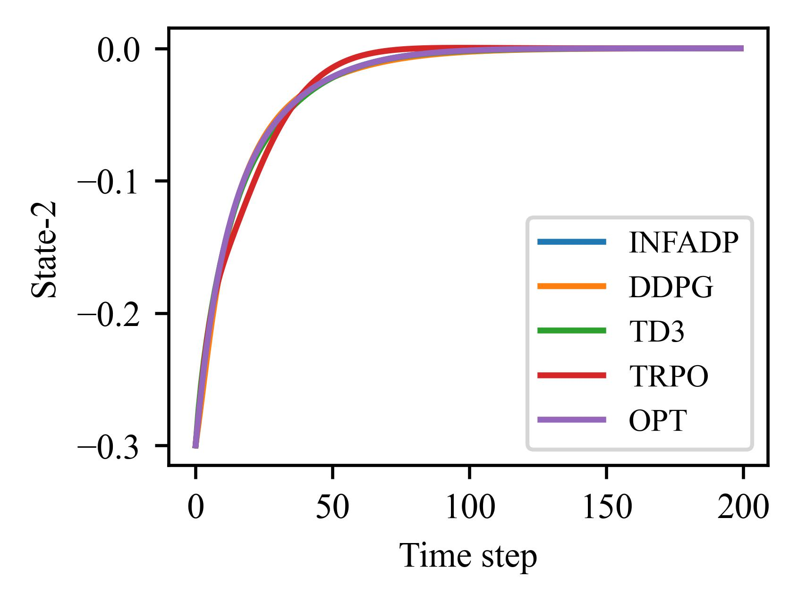
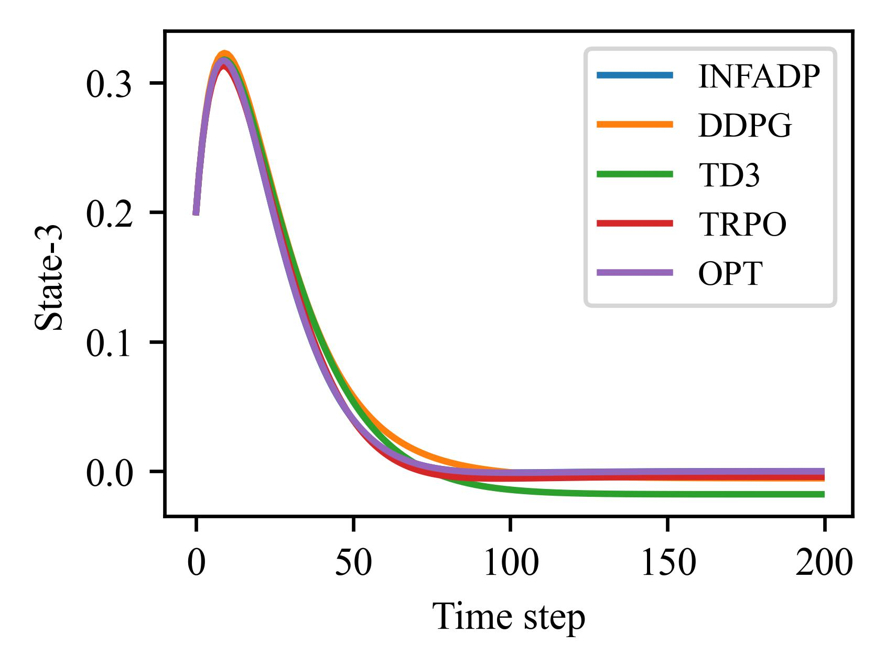
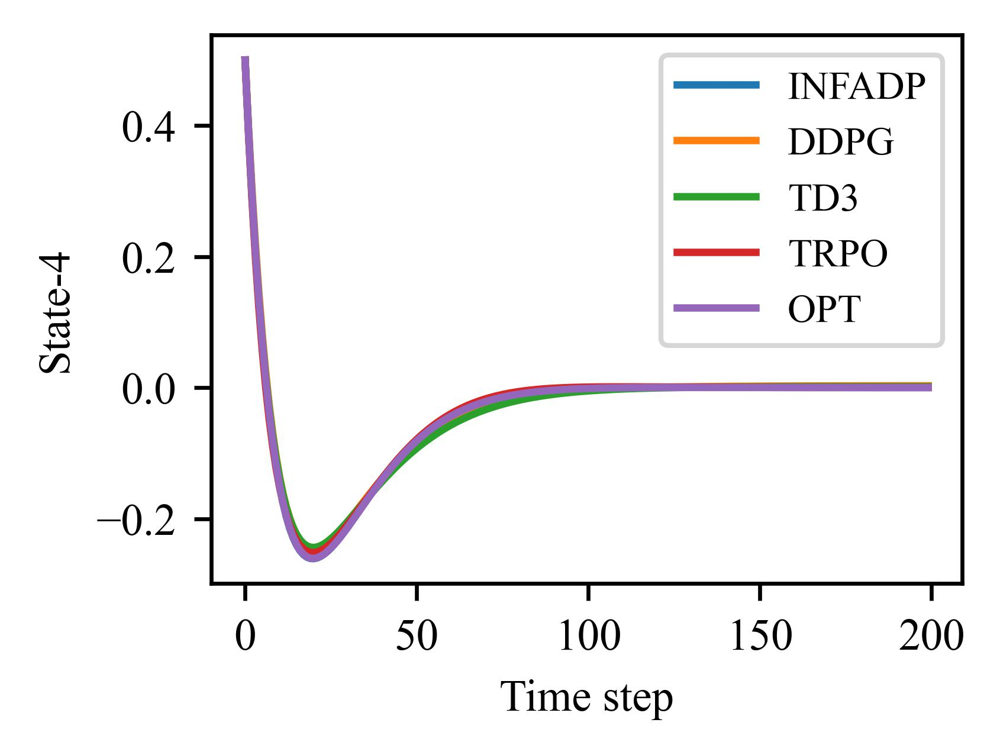
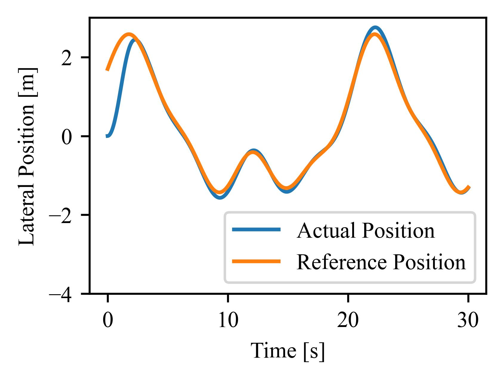
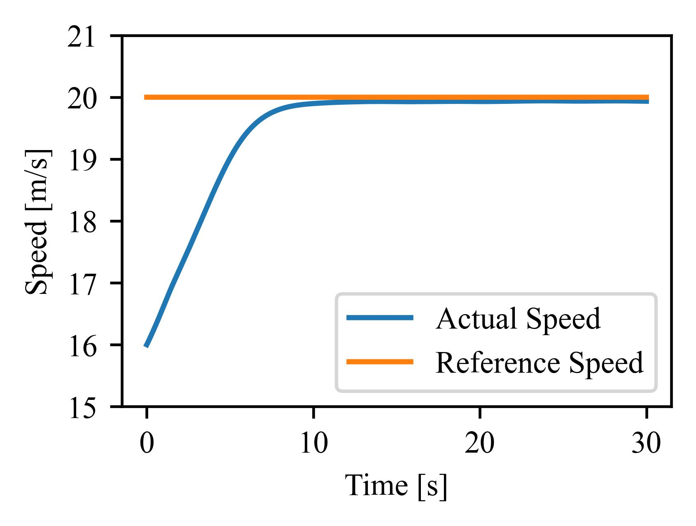
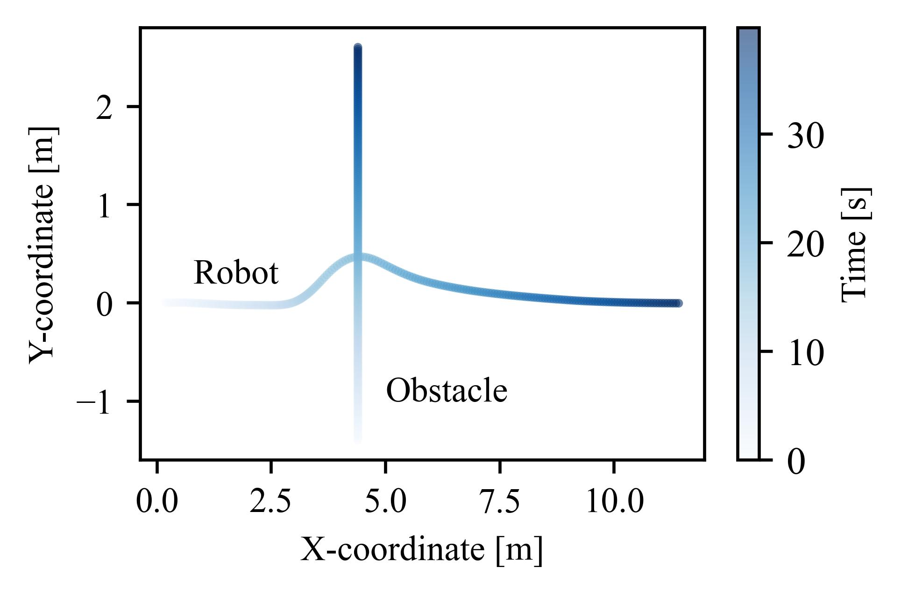
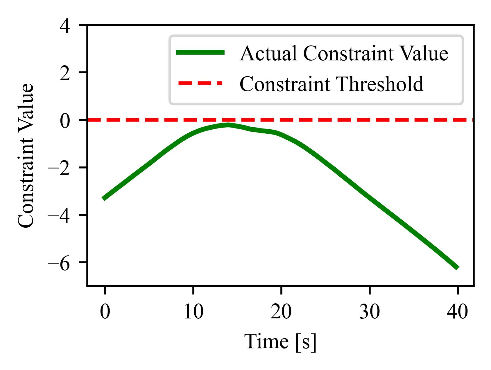
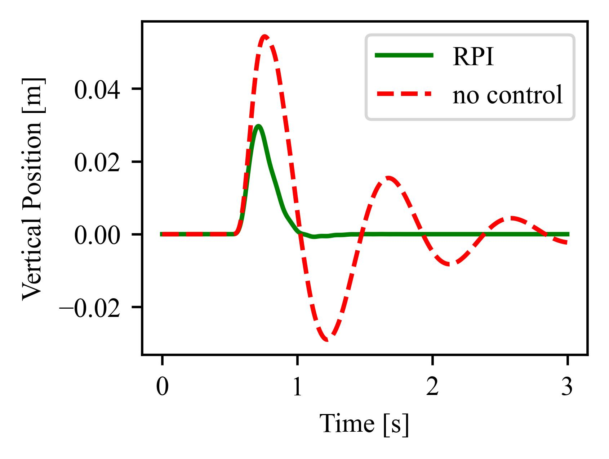
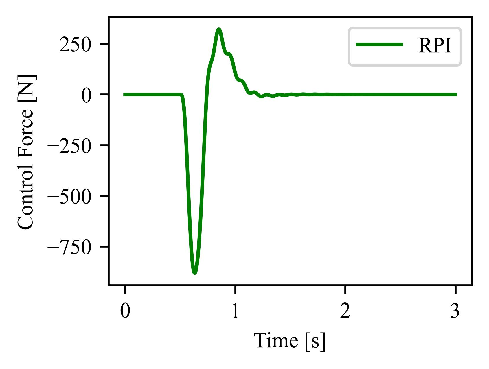

Benchmark
=======================================
GOPS supports both Mujoco environments and typical optimal control problems.

Mujoco Benchmark
---------------------
This section presents the performance of a series of model-free RL algorithms in GOPS on the Mujoco environments.
Every experiment is conducted under 5 random seeds for 1.5M RL iterations (30M environment steps).

.. raw:: html
   :file: ./plot_benchmark/benchmark_run2.html
   
Optimal Control Problems
---------------------------
This section presents the performance of several algorithms on typical industrial optimal control problems, including linear quadratic regulator (LQR), 
tracking problem, constrained control problem, robust control problem. 

LQR
^^^^^^^^^^^^^^^^^^^^^^^^^^^^^^^^^
The figure and table show how well various algorithms perform on the LQR problem.
The problem has 4 states and 2 control inputs and can be solved using analytical methods. 
The algorithms are evaluated based on the relative error between the states and control inputs produced by their learned policies
and those of the analytical solution.

+------------+--------------------+---------------------+--------------------+---------------------+
| Algorithm  | Max action-1 error | Mean action-1 error | Max action-2 error | Mean action-2 error |
+============+====================+=====================+====================+=====================+
| INFADP     | **1.21%**          | **0.22%**           | **0.34%**          | **0.09%**           |
+------------+--------------------+---------------------+--------------------+---------------------+
| DDPG       | 7.21%              | 0.94%               | 2.67%              | 0.41%               |
+------------+--------------------+---------------------+--------------------+---------------------+
| TD3        | 6.49%              | 0.59%               | 1.72%              | 0.40%               |
+------------+--------------------+---------------------+--------------------+---------------------+
| TRPO       | 8.28%              | 1.66%               | 4.49%              | 0.49%               |
+------------+--------------------+---------------------+--------------------+---------------------+

Vehicle Tracking
^^^^^^^^^^^^^^^^^^^^^^^^^^^^^^^^^
The figure and table show how well various algorithms perform on the vehicle tracking problem, 
a common optimal control problem in autonomous driving. 
The training environment is converted from an official `simulink vehicle model`_ using GOPS conversion tools. 
The trained policy is then tested in the simulink model to evaluate its closed-loop control performance.

+------------------------+------------------------+------------------------+------------------------+
| Algorithm              | SAC                    |  DSAC                  | PPO                    |
+========================+========================+========================+========================+
| Position error (m)     | 0.084±0.019            | **0.032±0.005**        | 0.052±0.012            |
+------------------------+------------------------+------------------------+------------------------+
| Velocity error (m/s)   | 0.068±0.011            | **0.035±0.005**        | 0.039±0.007            |
+------------------------+------------------------+------------------------+------------------------+

.. _simulink vehicle model: https://ww2.mathworks.cn/help/releases/R2019b/vdynblks/ref/vehiclebody3dof.html

Constrained Control Problem
^^^^^^^^^^^^^^^^^^^^^^^^^^^^^^^^^
GOPS offers constrained RL algorithms that can handle constrained optimal control problems. 
In the mobile robot obstacle avoidance task shown below, the robot agent trained by `SPIL`_ algorithm is able to maintain a safe distance from obstacles.
This is indicated by the negative constraint value along the robot's trajectory.

.. _SPIL: https://arxiv.org/abs/2102.08539

Robust Control Problem
^^^^^^^^^^^^^^^^^^^^^^^^^^^^^^^^^
GOPS includes robust RL algorithms that can maintain acceptable control performance despite modeling errors and disturbances. 
In the active suspension control problem shown below, the robust policy trained using the `RPI`_ algorithm 
effectively reduces the vibration of the sprung mass under unknown roadbed disturbances compared to a no-control scenario.

.. _RPI: https://arxiv.org/abs/2007.06810

