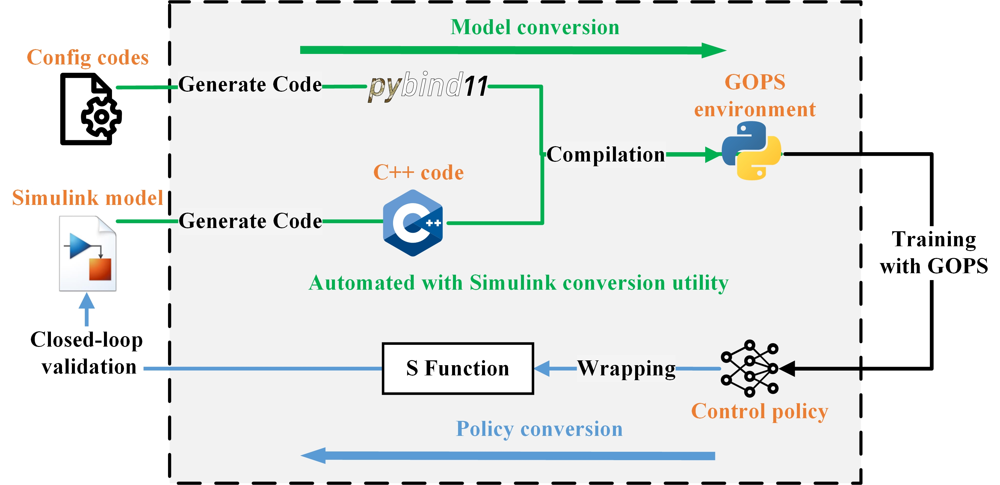

Simulink Conversion Tools
========================================

GOPS includes a utility tool that can convert standard Simulink models into GOPS-compatible environments 
and send trained policies back to Simulink for validation. The tool's pipeline is shown in the figure below.

After configuring the Simulink model, GOPS uses MATLAB Embedded Coder to generate C++ code and extract model I/O and parameters. 
It then generates pybind11 binding code using templates to create a Python-compatible environment that has the same input and output as the Simulink model.
This environment retains the ability to manually adjust critical parameters, avoiding the need to rebuild the binary file and simplifying setup. 

Additionally, the tool can send the trained policy back to Simulink by wrapping it in an S-Function block. 
This block can be easily integrated into a Simulink model for performance evaluation or controller deployment.

.. toctree::
   :hidden:
   :maxdepth: 2

   slx2py
   py2slx
