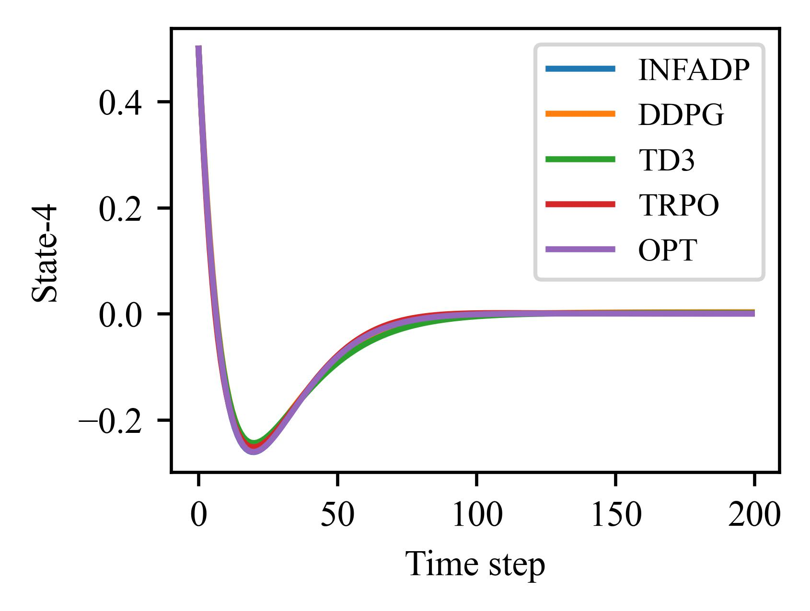
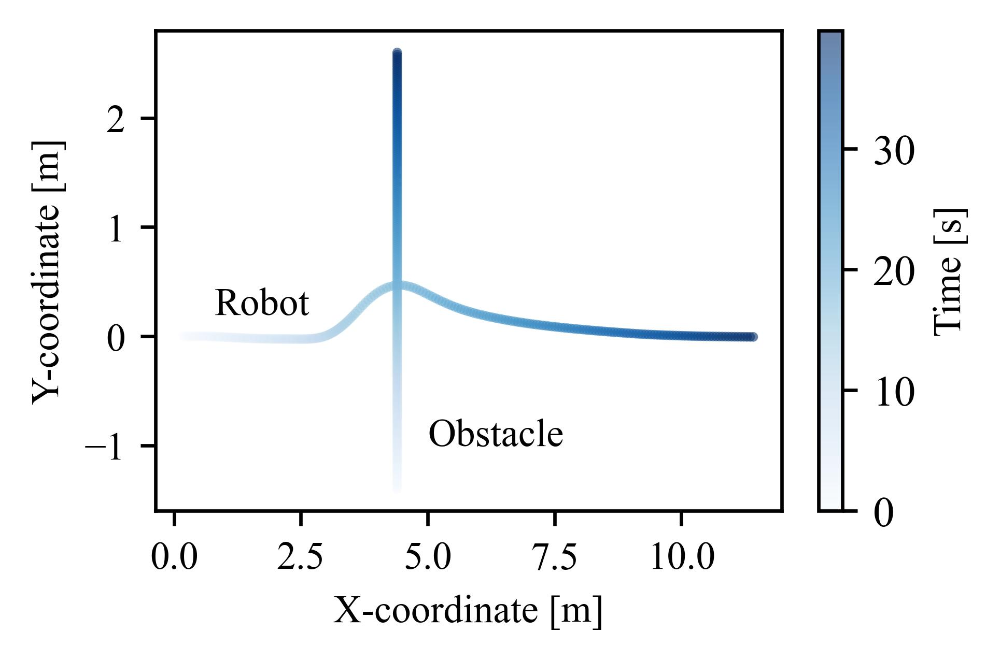
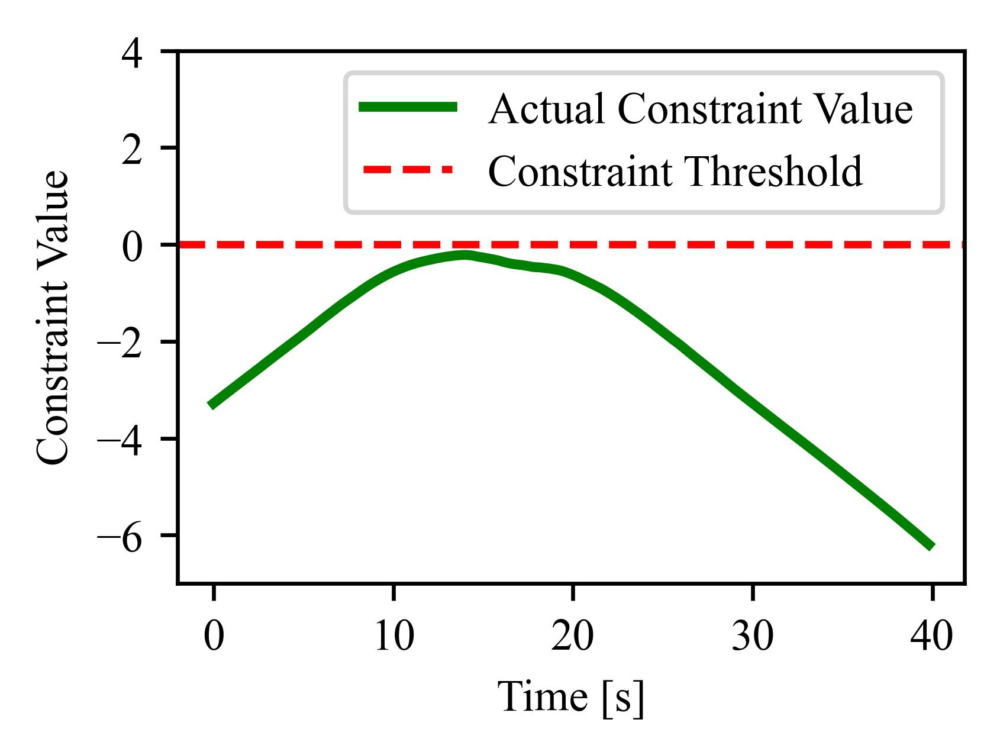
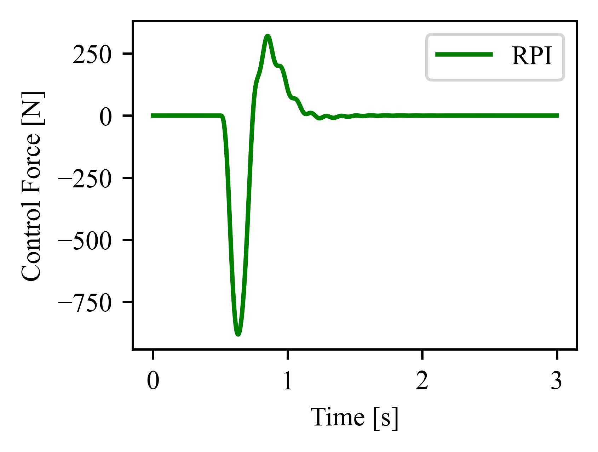

Benchmark
=======================================
Algorithm performance benchmark for Mujoco enviromnents and typical optimal control problems.

Mujoco Benchmark
---------------------
Every experiment is conducted under 5 random seeds for 30M env steps.

.. raw:: html
   :file: plot_benchmark/benchmark_run2.html
   
Optimal Control Problems
---------------------------
Algorithm performance benchmark for some typical industrial optimal control problems, including Linear Quadratic Regulator (LQR), 
tracking problem, constraint control problem, robust control problem. 

LQR
^^^^^^^^^^^^^^^^^^^^^^^^^^^^^^^^^
The figure and table presented depict the performance of various algorithms on the LQR problem with 4 states and 2 control inputs, 
which is a relatively straightforward optimal control problem that can be solved using analytical methods. 
The performance of these algorithms is evaluated based on the degree of similarity between the states and control inputs produced by the learned policies 
and those of the analytical optimal policy.

.. image:: figures&videos/LQR_1.jpg
   :width: 45%

.. image:: figures&videos/LQR_2.jpg
   :width: 45%

.. image:: figures&videos/LQR_3.jpg
   :width: 45%

+------------+--------------------+---------------------+--------------------+---------------------+
| Algorithm  | Max action-1 error | Mean action-1 error | Max action-2 error | Mean action-2 error |
+============+====================+=====================+====================+=====================+
| INFADP     | **1.21%**          | **0.22%**           | **0.34%**          | **0.09%**           |
+------------+--------------------+---------------------+--------------------+---------------------+
| DDPG       | 7.21%              | 0.94%               | 2.67%              | 0.41%               |
+------------+--------------------+---------------------+--------------------+---------------------+
| TD3        | 6.49%              | 0.59%               | 1.72%              | 0.40%               |
+------------+--------------------+---------------------+--------------------+---------------------+
| TRPO       | 8.28%              | 1.66%               | 4.49%              | 0.49%               |
+------------+--------------------+---------------------+--------------------+---------------------+

Vehicle Tracking
^^^^^^^^^^^^^^^^^^^^^^^^^^^^^^^^^
The figure and table presented depict the performance of various algorithms on the vehicle tracking problem,
which is a typical optimal control problem in the field of autonomous driving.
The training environment is transformed from a official `simulink vehicle model`_ using the convert tools in GOPS.
The trained policy is then sent back to the simulink model to verify the close-loop control performance, as shown in the followng figure.
The tracking performances of serveral algorithms are summarized in the table.

+------------------------+------------------------+------------------------+------------------------+
| Algorithm              | SAC                    |  DSAC                  | PPO                    |
+========================+========================+========================+========================+
| Position error (m)     | 0.084±0.019            | **0.032±0.005**        | 0.052±0.012            |
+------------------------+------------------------+------------------------+------------------------+
| Velocity error (m/s)   | 0.068±0.011            | **0.035±0.005**        | 0.039±0.007            |
+------------------------+------------------------+------------------------+------------------------+

.. image:: figures&videos/Vehicle_1.jpg
   :width: 45%

.. image:: figures&videos/Vehicle_2.jpg
   :width: 45%

.. _simulink vehicle model: https://ww2.mathworks.cn/help/releases/R2019b/vdynblks/ref/vehiclebody3dof.html

Constraint Control Problem
^^^^^^^^^^^^^^^^^^^^^^^^^^^^^^^^^
The built-in constraint RL algorithms in GOPS can handle the constraint control problem, as shown in the following mobile robot obstacle avoidance task.
Notice that the constraint value is minus along the trajectory, which means the robot is able to keep a safe distance from the obstacle.

Robust Control Problem
^^^^^^^^^^^^^^^^^^^^^^^^^^^^^^^^^
GOPS provides robust RL algorithms to ensure acceptable control performance within a certain range of modeling error and disturbance.
Take active suspension control of a quarter-car system as an example, compared with the no-control situation, the learned policy well attenuates the vibration of the sprung mass.

.. image:: figures&videos/Robust_1.jpg
   :width: 45%

