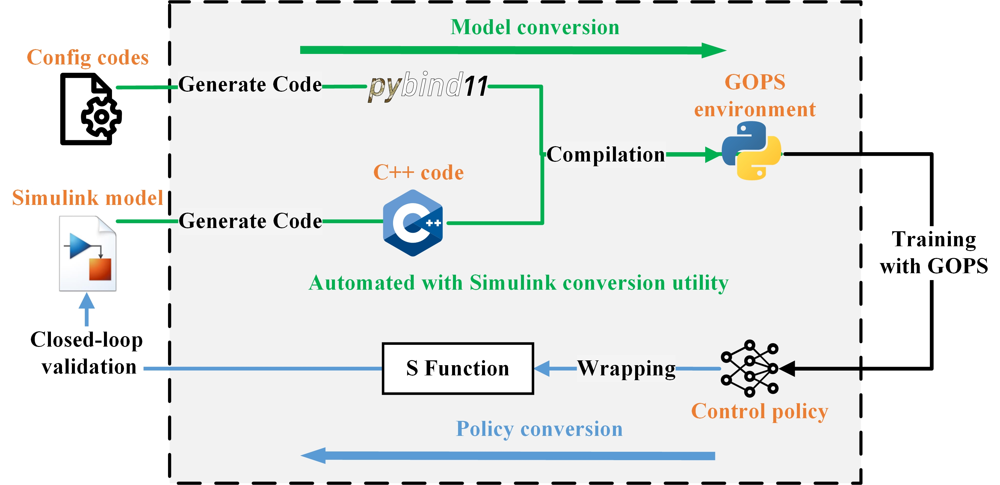

Simulink Conversion Tools
========================================

GOPS offers a utility tool that can convert standard Simulink models into GOPS-compatible environments 
and then sends the trained policy back to Simulink for validation.

The pipeline of this utility tool is shown in the following figure. 
After properly configuring the Simulink model, GOPS uses MATLAB Embedded Coder to generate C++ codes, reads model metadata to extract model I/O and parameters, 
and generates pybind11 binding codes with templates to become Python-compatible environments.

The compiled environment retains the ability to manually tune critical parameters, which avoids repeatedly rebuilding the binary file and simplifies the environment setups.
It preserves features such as cross-platform support, high execution efficiency, and type hint generation. 

Once an optimal control policy is found, the tool can send it back to Simulink by wrapping it in an S-Function block, which can be easily integrated into a Simulink model for performance evaluation or controller deployment.

.. toctree::
   :hidden:
   :maxdepth: 2

   slx2py
   py2slx
